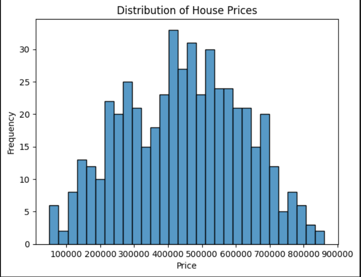

# 📊 Supervised Machine Learning Practical Exam

## 📌 Project Overview

This project covers a complete supervised machine learning pipeline including:

* Regression (house_price.csv)
* Classification (customer_churn.csv)
* Data preprocessing, modeling, evaluation, and ensemble techniques

The goal was to build, compare, and interpret multiple ML models while handling real-world challenges like **missing values and class imbalance**.

---

## 📸 Screenshots

---

## 📂 Datasets Used

### 🏠 House Price Dataset (Regression)

* Rows: 500
* Target: `price`
* Key Features:

  * area_sqft
  * bedrooms
  * bathrooms
  * location_score
  * distance_from_city_km

---

### 📉 Customer Churn Dataset (Classification)

* Rows: 800
* Target: `churn` (0 = No, 1 = Yes)
* Imbalance: ~86% No / ~14% Yes

---

## ⚙️ Key Steps Performed

### 🔹 Data Preprocessing

* Missing value handling (Median, KNN Imputer)
* Feature engineering (`price_per_sqft`)
* One-Hot Encoding
* Feature scaling (StandardScaler)
* Outlier removal (IQR)

---

### 🔹 Regression Models

* Linear Regression
* Ridge & Lasso
* Polynomial Regression
* Decision Tree Regressor
* Random Forest Regressor
* Gradient Boosting Regressor

---

### 🔹 Classification Models

* Logistic Regression
* Decision Tree Classifier
* Random Forest (Tuned)
* SVM (Tuned)
* KNN
* Naive Bayes

---

### 🔹 Imbalance Handling

* SMOTE
* ADASYN
* Random Under Sampling

---

### 🔹 Ensemble Methods

* Voting (Hard & Soft)
* Stacking
* Bagging
* Boosting (AdaBoost, Gradient Boosting)

---

## 📊 Regression Summary

| Model             | Train RMSE | Test RMSE | Test R²   |
| ----------------- | ---------- | --------- | --------- |
| Linear Regression | 8405       | 13847     | 0.860     |
| Ridge             | 8405       | 13847     | 0.860     |
| Lasso             | 8442       | 13882     | 0.859     |
| Polynomial        | 378422     | 336818    | -81.727   |
| Decision Tree     | **4195**   | **11788** | **0.899** |
| Random Forest     | 12649      | 24207     | 0.573     |
| Gradient Boosting | 58         | 14106     | 0.855     |

---

## 📊 Classification Summary

| Model               | Accuracy | F1 (Churn=1) | AUC  |
| ------------------- | -------- | ------------ | ---- |
| Logistic Regression | 0.85     | 0.00         | 0.50 |
| LR + SMOTE          | 0.63     | 0.17         | 0.44 |
| Decision Tree       | 0.82     | 0.00         | 0.53 |
| Random Forest       | 0.85     | 0.00         | 0.53 |
| SVM                 | 0.48     | **0.21**     | 0.52 |
| KNN                 | 0.76     | 0.05         | 0.52 |
| Naive Bayes         | 0.85     | 0.00         | 0.45 |
| Voting              | 0.85     | 0.00         | 0.51 |
| Stacking            | 0.85     | 0.00         | 0.44 |

---

## 🧠 Key Insights

### 🔹 Regression

* ✅ **Decision Tree performed best**
* ❌ Polynomial Regression severely overfit
* ⚠️ Random Forest underperformed unexpectedly

---

### 🔹 Classification

* ❌ Most models failed to detect churn (F1 = 0)
* ⚠️ Accuracy was misleading due to imbalance
* ✅ SVM & SMOTE slightly improved minority detection

---

### 🔹 Imbalance Impact

* Class imbalance was the **biggest challenge**
* SMOTE improved recall but not enough

---

## 🏆 Final Conclusion

* 📌 **Best Regression Model:** Decision Tree
* 📌 **Best Classification Model:** SVM (but still weak)
* 📌 **Most Important Preprocessing Step:** SMOTE
* ⚠️ **Major Limitation:** Models failed to predict minority class effectively due to imbalance

---

## ⚠️ Limitations

* Severe class imbalance → poor churn detection
* Low F1 and AUC scores
* Ensemble methods failed due to weak base models

---

## 🚀 Future Improvements

* Use advanced techniques (XGBoost, LightGBM)
* Better feature engineering
* Use class weighting + threshold tuning together
* Collect more balanced data

---

## 🎯 Conclusion

This project demonstrates that:

* High accuracy ≠ good model
* Handling imbalance is critical
* Ensemble methods need strong base learners

---

## 🙌 Final Note

Machine Learning is not just about models —
it’s about **understanding data and its limitations**.